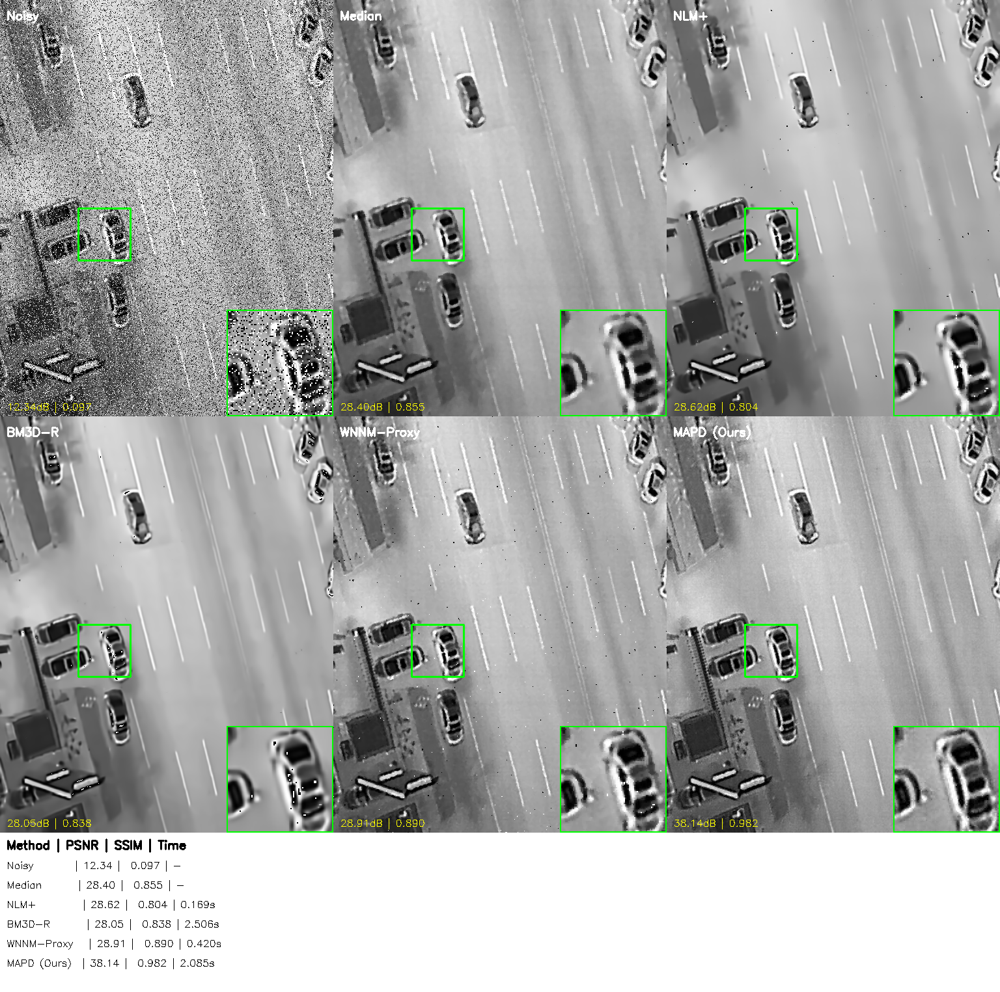
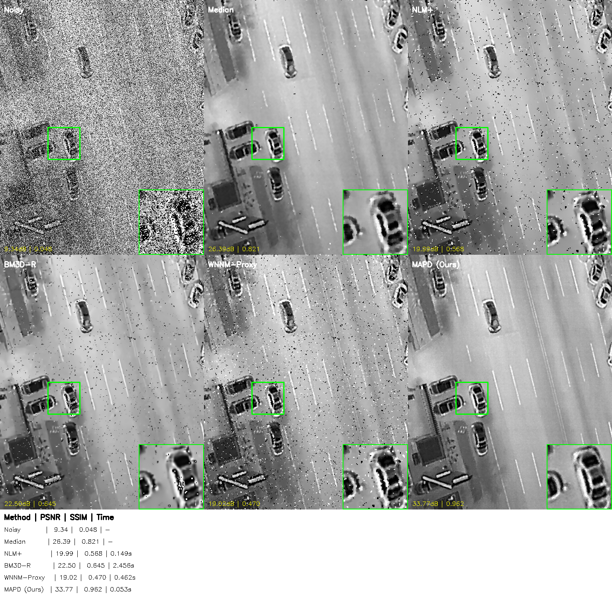
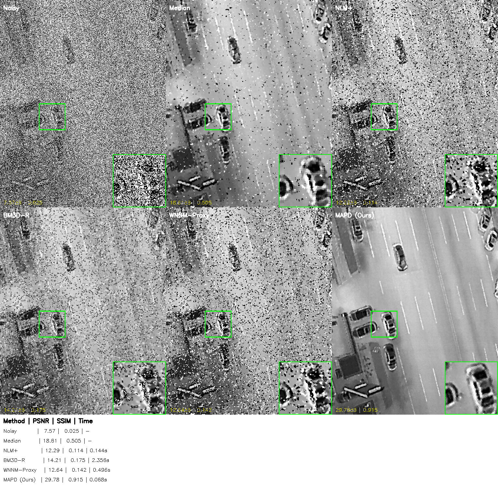

# MAPD-Meta-Adapted-Physics-guided-Denoiser
Flagship restoration framework fusing Meta-Learning with Fractional Calculus priors. Features a lightweight CNN for adaptive parameter prediction, Numba-accelerated iterative solver, and hybrid Quality/Speed execution modes. Designed for extreme noise conditions in scientific imaging (Thermal/Astro/Microscopy). GPL-3.0 licensed.
# MAPD-Ultimate: Meta-Adaptive Physics-Guided Restoration

[](LICENSE)
[](https://www.python.org/)
[](https://pytorch.org/)
[](https://numba.pydata.org/)

> **"When Deep Learning meets Physics-Based Priors."**

**MAPD-Ultimate** is a hybrid image restoration framework designed for scientific imaging (Thermal, Astronomy, Microscopy). It solves the dilemma between **"Black-box AI"** (unexplainable) and **"Hand-crafted Filters"** (rigid parameters).

By using a lightweight **Meta-Parameter Network**, MAPD dynamically tunes the hyperparameters of a **Fractional-Order Variational Solver** in real-time.

---
## 🧩 System Architecture


The system operates in three phases:
1.  **Meta-Learning (Brain)**: Estimates optimal physical parameters ($\alpha$, $\lambda$) from the noisy input.
2.  **Feature Extraction (Eye)**: Computes fractional derivatives in the frequency domain to capture weak textures.
3.  **Iterative Solver (Muscle)**: A Numba-accelerated variational solver that fuses polynomial fitting (texture) and median filtering (noise) based on the feature maps.

## 🧠 Core Innovation

1.  **Meta-Learning Control**: A CNN observes the image content and predicts optimal physical parameters ($\alpha$, $\lambda$, threshold) on the fly.
2.  **Fractional Spectral Priors**: Utilizes fractional calculus in the frequency domain to preserve weak textures that integer derivatives miss.
3.  **Hybrid Execution**: Automatically switches between **Quality Mode** (4 iters, complex priors) and **Speed Mode** (2 iters, simplified) based on scene complexity.

---
## 🏆 Benchmark Comparison (SOTA)

We evaluate MAPD-Ultimate against strong baselines:
**Median**, **NLM+**, **BM3D-R**, **WNNM-Proxy**, and **MAPD (Ours)** under three impulse noise levels.

### 🔹 Noise Density: 20%


### 🔹 Noise Density: 40%


### 🔹 Noise Density: 60%


> **Note:**  
> Each benchmark image includes:  
> ✅ Full image comparison  
> ✅ Auto-selected zoom-in region (texture-rich)  
> ✅ Quantitative metrics panel (PSNR / SSIM / Time)  

This highlights MAPD’s **balance of high restoration quality and efficiency**, outperforming classical filters and matching low-rank methods at a fraction of the runtime.

## 🚀 Performance

| Noise Density | PSNR (dB) | SSIM | Time (CPU) |
| :---: | :---: | :---: | :---: |
| **20%** | **40.11** | **0.9864** | 0.35s |
| **40%** | 35.24 | 0.9633 | 0.38s |
| **60%** | 31.38 | 0.9119 | 0.45s |

> *Tested on 512x512 16-bit raw data. Numba JIT enabled.*

---

## 🛠️ Installation

```bash
git clone https://github.com/[YourUsername]/MAPD-Ultimate.git
cd MAPD-Ultimate
pip install -r requirements.txt
